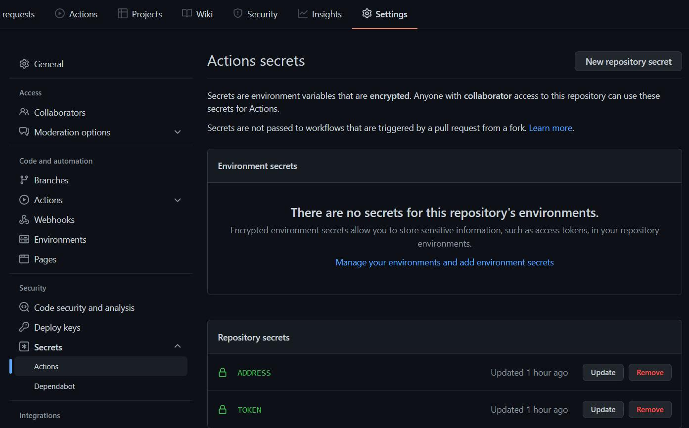

# EzilMonitor
## 简介
这是一个超级简单的监控EZIL在线机器数量并发送到[PUSHPLUS](https://www.pushplus.plus)

## 准备工作
1. 点击右上角的FORK，并切换至自己仓库
2. 点击**Settings**->**Secrets**->**Actions**
   
3. 点击右上角**New repository secret**
4. 第一个**Name**为`ADDRESS`，**Value**为钱包地址如
   0x0000000000000000000000000000000000.zilxxxxxxxxxxxxxxxxxxxxxxxxxxxxxxxxxxxxxx
5. 第二个**Name**为`TOKEN`，**Value**可到[PUSHPLUS](https://www.pushplus.plus/push1.html)扫描二维码获取

## 查看Actions
如果没有意外的话，已经可以运行了，1min自动监控一次

   
   

